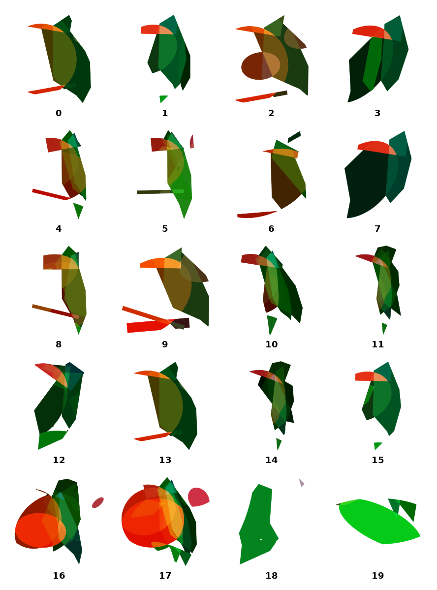
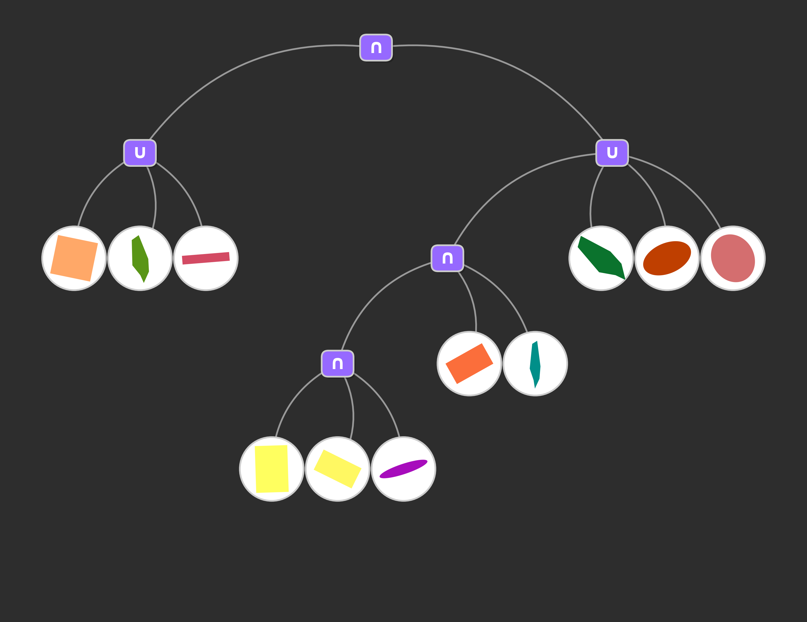
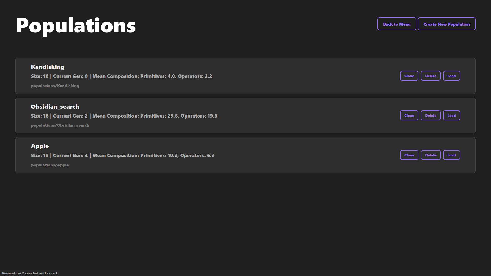
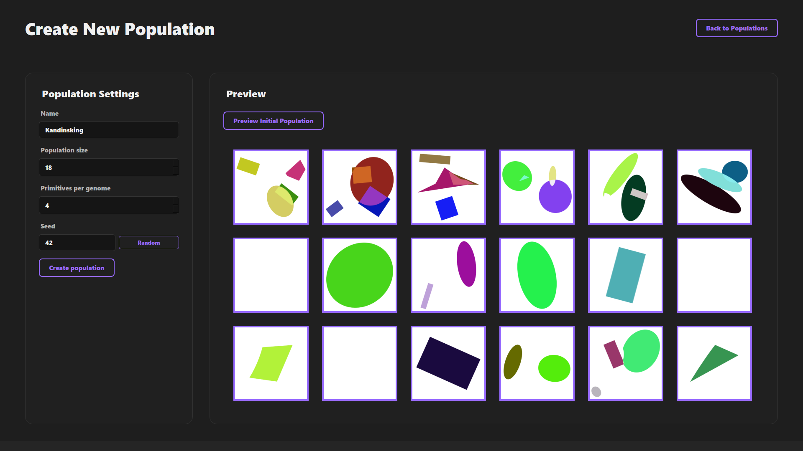

# 🎨 Evolving Art — Interactive GUI Edition

An interactive desktop application for evolving generative artwork through guided visual selection.

This project extends the original *evolving-art* engine with a full graphical experience. While the core evolutionary logic is inherited, the rendering system, interface, export utilities, and workflow have been redesigned for hands-on creative exploration.

> Fork of the original project:  
> **https://github.com/gianluccacolangelo/evolving-art**

---

## ✨ Improvements in This Fork

| Feature / System                                  | Original | This Fork |
|--------------------------------------------------|:--------:|:---------:|
| Evolution engine (genome + mutation logic)        |   ✅     | **Inherited** |
| Rendering pipeline                                 | Basic    | **Fully rewritten vector engine** |
| Workflow                                          | CLI      | **Interactive GUI (PySide6)** |
| Population inspector + metadata                   | ❌       | **Added** |
| Live mutation + inspector controls                | ❌       | **Added** |
| Interactive multi-selection evolution             | Basic    | **Enhanced** |
| Export (individual + population + tree)           | Basic    | **Full PNG/SVG export system** |

---

## 🧪 Example Output

This fork introduces enhanced export tools for documenting evolution. The population view and genome tree can be exported in high resolution as **PNG or SVG**.

### Population Grid Example



> Each numbered cell represents an evolved candidate. The user selects preferred individuals, and the system generates the next generation based on their selection.

### Genome Composition Tree Example



> The composition tree visualizes the underlying genome used to generate the selected artwork, allowing inspection, debugging, or creative manipulation.

---

## 🖥 Screenshots

| Screen | Preview |
|--------|---------|
| **Main Menu** |  |
| **Population Browser** |  |
| **Create Population** |  |
| **Evolution Workspace** |  |

---

## 🚀 Quick Start

```bash
conda env create -f environment.yml
conda activate evolving-art
python main.py

```

---

## 🧬 How It Works

The app uses an evolutionary pipeline:

1. Generate an initial population of visual genomes
2. Render and display results
3. User selects preferred individuals
4. Engine mutates and breeds new candidates
5. Repeat and explore emergent creative forms

Everything is saved automatically, including metadata and full lineage.

---

## 🧱 Architecture Overview

```
src/
 ├─ core/                    # Evolution engine (from original repo)
 ├─ rendering/              # New rendering pipeline
 ├─ app/                    # PySide6 GUI (screens, widgets, theme)
 ├─ population_manager/     # Persistence, metadata, autosave, history
main.py                     # Entry point
```

---

## 🖼 Rendering System

This fork includes an entirely reworked rendering stack featuring:

* Vector-based geometry extraction
* Shapely-driven boolean geometry evaluation
* SDF-free raster backend (replacing the original pipeline)
* Options for:

  * PNG export
  * SVG export
  * Generation sheet export
* Auto bounds with override support

---

## 📦 Saving & Export

* Individuals: **PNG / SVG**
* Composition Tree **PNG / SVG**
* Whole generations: **grid export**

Populations genomes are stored under:

```
populations/<name>/history/gen_###.json
```

---

## 🔗 Attribution

* Evolution engine base → **gianluccacolangelo / evolving-art**
* Rendering, GUI, interaction logic → **This fork**

---


