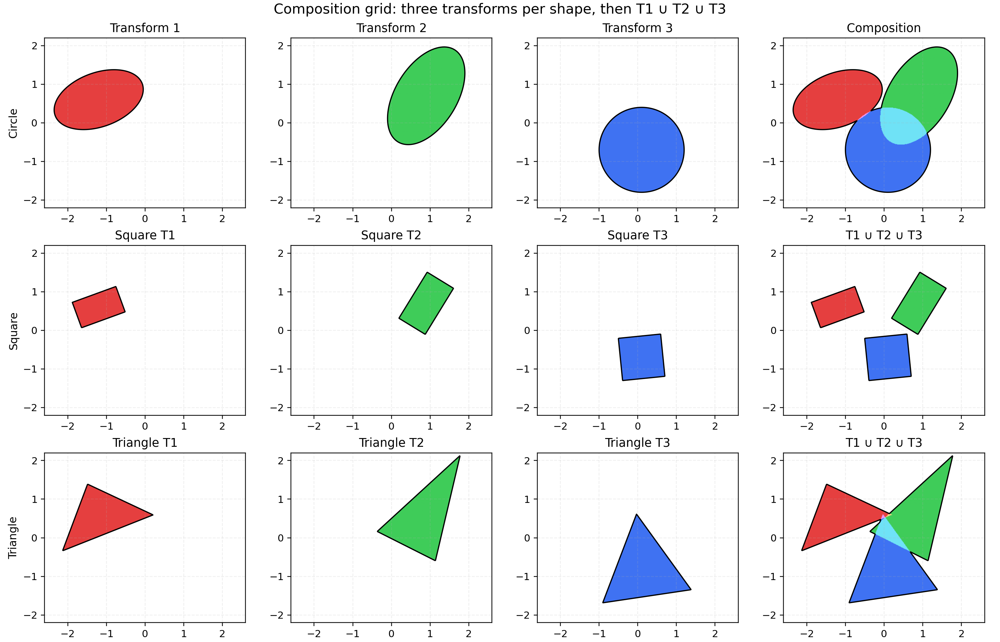
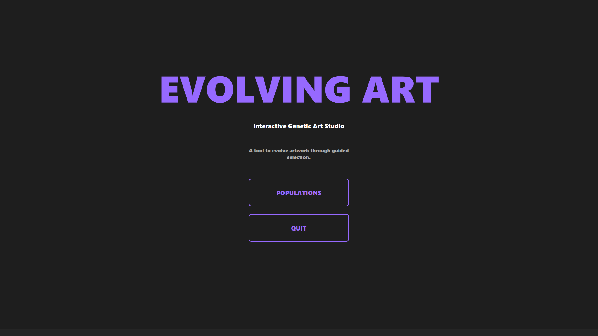
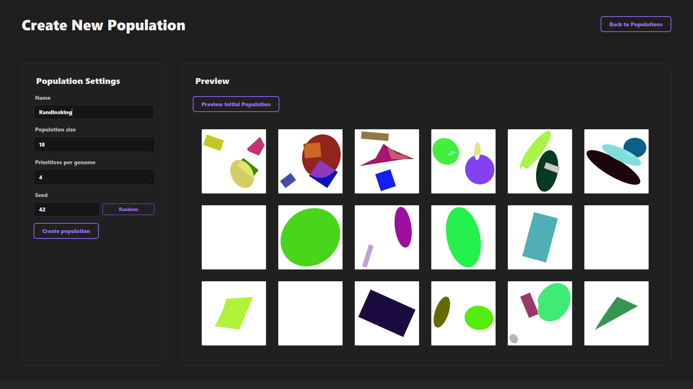
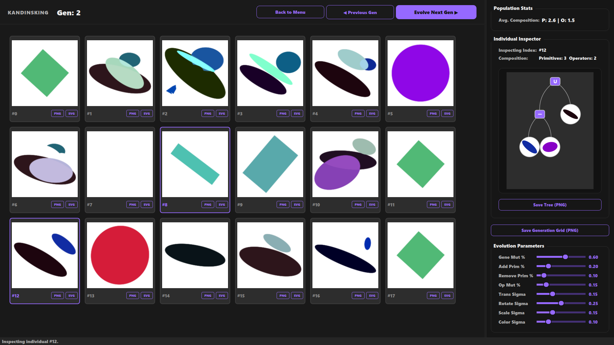

# Evolving Art - Interactive GUI Edition

**Interactive desktop application for evolving generative art through guided selection.**

This is a fork of [gianluccacolangelo/evolving-art](https://github.com/gianluccacolangelo/evolving-art), extending the original SDF-based evolutionary art framework with a complete PySide6 GUI application for interactive evolution.



## Screenshots

### Menu Screen
Game-style interface with population management



### Populations Browser
Manage saved populations with rich metadata


### Create Population
Initialize new evolution experiments with custom parameters



### Evolution Screen
Multi-select grid with live previews, inspector panel, and mutation controls



## What's New in This Fork

### 🎨 Interactive Desktop Application

Complete GUI application on top of the original framework that enables:

| Feature | Original | This Fork |
|---------|----------|-----------|
| Core SDF Framework | ✅ | ✅ |
| Evolution Operators | ✅ | ✅ |
| Command-line Scripts | ✅ | ✅ |
| **Desktop GUI** | ❌ | ✅ |
| **Population Browser** | ❌ | ✅ |
| **Interactive Selection** | ✅ | ✅ |
| **Tree Visualization** | ✅ | ✅ |
| **Live Mutation Controls** | ❌ | ✅ |
| **Auto-save & History** | ❌ | ✅ |

- **Population Management**: Create, load, clone, and organize multiple evolution experiments
- **Interactive Evolution**: Select favorite individuals each generation and watch art evolve
- **Real-time Visualization**: Live composition tree inspection with geometric previews
- **Parameter Control**: Adjust mutation rates, transforms, and operators on the fly
- **Multi-format Export**: Save individuals as PNG or SVG, export generation grids
- **Persistent History**: Auto-save with full generation history and metadata

### Application Features

```bash
# Launch the GUI application
python main.py
```

The application provides:
- **Menu Screen**: Game-style landing interface
- **Populations Browser**: Manage saved populations with rich metadata
- **Evolution Screen**: Multi-select interface with live previews
- **Inspector Panel**: Real-time genome statistics and tree visualization
- **Mutation Controls**: Live sliders for all evolution parameters

### Quick Start

```bash
# Install dependencies
conda env create -f environment.yml
conda activate evolving-art

# Launch the GUI
python main.py
```

### Architecture

- `src/app/` - PySide6 GUI application (screens, widgets, theme)
- `src/population_manager/` - Population I/O, state management, serialization
- `src/rendering/tree_renderer.py` - Composition tree visualization
- `src/rendering/vectorizer/` - Shapely-based geometry renderer with color algebra
- `main.py` - Application entry point

## Original Framework (Credit to gianluccacolangelo)
## Framework essentials

- **Primitives** (2D, SDF-based):
  - `UnitDisk()` — unit circle at origin
  - `UnitSquare()` — unit square centered at origin
  - `Polygon(vertices)` — arbitrary simple polygon (N≥3)
  - Optional: `HalfSpace(n, c)` for half-plane constructions

- **Chainable transforms** on any `Shape`:
  - `shape.scale(sx[, sy]).rotate(theta).translate(dx, dy)`
  - Colors (optional, RGB in [0,1]): `shape.with_color(r, g, b)`

- **Set composition** (returns a `Shape`):
  - `A | B` union, `A & B` intersection, `A - B` difference
  - Variadic: `UnionN(A, B, C, ...)`, `IntersectionN(...)`

Minimal example:

```python
from shapes import UnitDisk, UnitSquare, Polygon

circle = UnitDisk().scale(1.2).translate(-0.6, 0.1).with_color(0.2, 0.8, 0.5)
square = UnitSquare().scale(1.0, 0.6).rotate(0.3).translate(0.8, 0.6).with_color(0.9, 0.2, 0.2)
tri = Polygon([[0.0, 1.3], [-1.3, -0.6], [1.2, -0.7]]).with_color(0.2, 0.45, 0.95)
shape = (circle | square) - tri
```

### Composability
- Every transform and set operator returns a `Shape`. That means you can apply transforms to already-composed shapes and keep nesting indefinitely.
- Colors are preserved through transforms and set operations via a general color algebra.

Example (transforming a composite):

```python
small_rotated = shape.scale(0.5).rotate(0.6).translate(0.2, -0.3)
```

### Setup

#### Using Conda (Recommended)

```bash
conda env create -f environment.yml
conda activate evolving-art
```

#### Using venv

```bash
python -m venv venv_evolving-art
source venv_evolving-art/bin/activate  # Linux/Mac
# or: venv_evolving-art\Scripts\activate  # Windows
pip install -r requirements.txt  # if available, or install manually
```

**Dependencies**: PySide6, NumPy, Matplotlib, Shapely, Pillow, Numba

#### Run the GUI

```bash
python main.py
```

## Rendering

- Render any shape (or list of shapes) with auto-bounds:

```python
from src.rendering.raster import render_shape_to_file

render_shape_to_file(shape, out_path="plots/my_shape.png", title="My composition")
```

- No outline by default; enable if desired: `draw_edges=True`.
- Pass explicit `xlim`/`ylim` to skip auto-bounds.
- You can also pass a list: `render_shape_to_file([shape1, shape2], ...)`.

## Rendering framework

A small rendering module provides auto-bounds and rendering for any composed `Shape` (or a list of shapes):

```python
from src.rendering.raster import render_shape_to_file, autosize_bounds
from src.core.shapes import UnitDisk, UnitSquare, Polygon

shape = (UnitDisk().scale(1.2).with_color(0.2, 0.8, 0.5) | UnitSquare().translate(0.8, 0.4).with_color(0.9, 0.2, 0.2))
render_shape_to_file(shape, out_path="plots/framework_demo.png", title="My composition")
```

- Auto-bounds: If you don’t pass `xlim`/`ylim`, the renderer samples a coarse grid to choose a tight extent.
- You can also pass a list of shapes; it will be unioned automatically for rendering.

See `plot_framework_demo.py` for a runnable example. It outputs `plots/framework_demo.png`.

## GUI Application Workflow

### 1. Create a Population

- Launch the app: `python main.py`
- Click "POPULATIONS" → "Create New Population"
- Set parameters: population size (e.g., 16), initial genes (e.g., 4), random seed
- Click "Initialize" - the app generates the first generation

### 2. Evolve Interactively

- Click on individuals you like (they highlight in the accent color)
- Click "Evolve to Next Generation"
- The selected individuals become parents for the next generation
- Mutations and crossover create variation

### 3. Adjust Parameters

The right panel lets you tune evolution in real-time:
- **Gene Mutation %**: Probability of mutating primitive parameters
- **Add/Remove Primitive %**: Structural changes to compositions
- **Operator Mutation %**: Change union/intersection/difference operators
- **Transform Sigmas**: Control mutation strength for scale, rotation, translation
- **Color Sigma**: Color variation intensity

### 4. Inspect & Export

- Click any individual to see its composition tree in the inspector
- Tree shows primitives (circles, squares, polygons) and operators (∪, ∩, −)
- Export buttons: Save individuals as PNG/SVG, save full generation grids
- All generations auto-saved to `populations/<name>/history/`

## Technical Details

### Evolution Engine (Original Framework)

The core uses a tree-based genome representation:
- **PrimitiveGene**: Shape type, transform (scale, rotate, translate), color, polygon vertices
- **OpNode**: Boolean operators (union, intersection, difference) combining primitives
- **Mutation**: Parameter tweaks, structural changes (add/remove primitives, change operators)
- **Crossover**: Subtree swapping between parents

### Rendering Pipeline

1. **Genome → Shape**: Tree evaluates to SDF-based `Shape` object
2. **Shape → Geometry**: Vectorizer converts to Shapely polygons with color algebra
3. **Geometry → Image**: Matplotlib/PIL renders to PNG/SVG

Color algebra implements:
- Union: `1 - (1-a)(1-b)` (screen blend)
- Intersection: `a * b` (product)
- Difference: `a * (1-b)`

### Population Management

- **Metadata**: JSON files track population config, creation date, statistics
- **Generation History**: Each generation saved as `gen_XXX.json` with full genome data
- **Serialization**: Custom JSON format preserves transform params, polygon vertices, tree structure

## Credits & License

**Original Framework**: [gianluccacolangelo/evolving-art](https://github.com/gianluccacolangelo/evolving-art)
- Core SDF framework, evolution operators, rendering foundation

**This Fork**: GUI application, population management, tree visualization, interactive evolution interface

Check the original repository for the framework's license and additional documentation.
